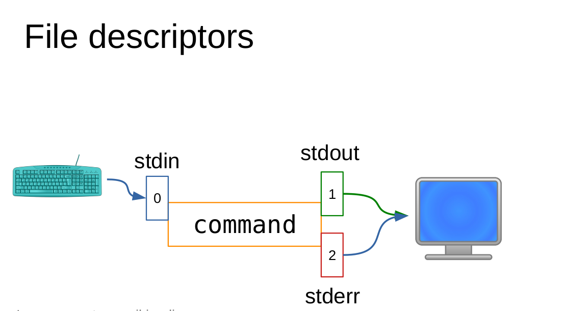

# Table of Content<!-- omit in toc -->

- [How to run multiple command in same line](#how-to-run-multiple-command-in-same-line)
- [Logical operations based on output of the commands](#logical-operations-based-on-output-of-the-commands)
- [File redirection](#file-redirection)
- [Writing txt in the file using cat command](#writing-txt-in-the-file-using-cat-command)
- [Taking input from file](#taking-input-from-file)
- [How to put output and error in same file](#how-to-put-output-and-error-in-same-file)
- [Using output of one command as an input for another command](#using-output-of-one-command-as-an-input-for-another-command)
- [Creation of black hole using /dev/null](#creation-of-black-hole-using-devnull)
- [How to redirect the output to file and screen at the same time](#how-to-redirect-the-output-to-file-and-screen-at-the-same-time)

## How to run multiple command in same line

- Using semicolon (**`;`**) in between the command we can run multiple commands.

```bash
(base) ashraf@320:~$ cd ; ls ; wc -l /etc/profile
anaconda3  Anime  Bsc_prog  Desktop  Documents  Downloads  Music  Pictures  Public  snap  temp  Templates  Videos
27 /etc/profile
```

- Another way to run multiple commands in same line is to excute commands in sub shells means child shells.
Using parentheses **`()`** we can lauch sub-shells with in the cureent shells.

```bash
# $BASH_SUBSHELL store the level of shell
(base) ashraf@320:~$ echo $BASH_SUBSHELL 
0
(base) ashraf@320:~$ (echo $BASH_SUBSHELL)
1
# we ran the ls,date and echo command in chile sub-shell
(base) ashraf@320:~$ (ls;date;echo $BASH_SUBSHELL)
anaconda3  Anime  Bsc_prog  Desktop  Documents  Downloads  Music  Pictures  Public  snap  temp  Templates  Videos
Saturday 15 January 2022 06:18:52 PM IST
1
# Here ls command is run on first child shell and echo is run on second child shell
(base) ashraf@320:~$ (ls ; (echo $BASH_SUBSHELL ))
anaconda3  Anime  Bsc_prog  Desktop  Documents  Downloads  Music  Pictures  Public  snap  temp  Templates  Videos
2
# More example here we ran the echo in third child shell
(base) ashraf@320:~$ (((echo $BASH_SUBSHELL ););)
3
```

***

## Logical operations based on output of the commands

- **`&&`** operator behave same as AND logic. Here next command will execte only if previous command ran sucessfully.

- **`||`** operator behave same as OR logic. Here next command will execte only if previous command did not run sucessfully.

```bash
(base) ashraf@320:~$ ls && date
anaconda3  Anime  Bsc_prog  Desktop  Documents  Downloads  Music  Pictures  Public  snap  temp  Templates  Videos
Saturday 15 January 2022 06:39:06 PM IST
(base) ashraf@320:~$ ls /blah && date
ls: cannot access '/blah': No such file or directory
(base) ashraf@320:~$ ls || date 
anaconda3  Anime  Bsc_prog  Desktop  Documents  Downloads  Music  Pictures  Public  snap  temp  Templates  Videos
(base) ashraf@320:~$ ls /blah || date
ls: cannot access '/blah': No such file or directory
Saturday 15 January 2022 06:39:51 PM IST
```

***

## File redirection

- Here we can see the default behaviour of command. How it takes output and gives input.


- We can change `1` pointer using **`>`** or **`>>`** operator. `>` store the output in the file and delete the previous content present in it. But `>>` append the output in the file at the end starting from new line without deleting the previous content. If file does not exist then it will be created freshly for the operator.

```bash
(base) ashraf@320:~$ touch file
(base) ashraf@320:~$ echo "first line" > file
(base) ashraf@320:~$ cat file 
first line
(base) ashraf@320:~$ echo "second line" > file
(base) ashraf@320:~$ cat file 
second line
(base) ashraf@320:~$ rm file 
(base) ashraf@320:~$ echo "first line" > file
(base) ashraf@320:~$ echo "second line" >> file
(base) ashraf@320:~$ cat file 
first line
second line
```

- **`2>`** operator redirect the `2` pointer means stderr to the file. Using this we can store the error in the file. We can also combine `>` and `2>` on same line.

```bash
(base) ashraf@320:~$ ls /blah Desktop/ > file1 2> file
(base) ashraf@320:~$ cat file1
Desktop/:
(base) ashraf@320:~$ cat file
ls: cannot access '/blah': No such file or directory
```

***

## Writing txt in the file using cat command

```bash
# we can also type txt in the file using cat  command on the terminal
(base) ashraf@320:~$ cat > file
first
second 
use ctrl +d to get out of the command
(base) ashraf@320:~$ cat file
first
second 
use ctrl +d to get out of the command
# using >> we can append the txt in to file
(base) ashraf@320:~$ cat >> file
third 
fourth
(base) ashraf@320:~$ cat file
first
second 
use ctrl +d to get out of the command
third
fourth
(base) ashraf@320:~$ cat 
Hi
Hi
hjhkjj
hjhkjj
```

***

## Taking input from file

- **`<`** using this operator we can give input to the command from a file.

```bash
# Normal execution
(base) ashraf@320:~$ wc -l file
5 file
# Here we give the content of file as a arrgument to wc command.
# that's why it doesnot print the file name in the output.
(base) ashraf@320:~$ wc -l < file
5
```

***

## How to put output and error in same file

- **`2>&1`** Here we are redirecting the stderr (`2` pointer) to stdout (`1` pointer) first.

- Then by using normal redirection we can get stderr and stdout in same file.

```bash
# Both stderr and stdout is in file
(base) ashraf@320:~/Pictures$ ls .  /blan >file 2>&1
(base) ashraf@320:~/Pictures$ cat file
ls: cannot access '/blan': No such file or directory
.:
file
Screenshot from 2021-12-29 13-15-44.png
Screenshot from 2021-12-30 23-25-48.png
Screenshot from 2022-01-09 17-32-45.png
Screenshot from 2022-01-14 14-09-08.png
# only stdout is in file because stderr was overwritten
(base) ashraf@320:~/Pictures$ ls .  /blan >file 2> file
(base) ashraf@320:~/Pictures$ cat file
.:
file
Screenshot from 2021-12-29 13-15-44.png
Screenshot from 2021-12-30 23-25-48.png
Screenshot from 2022-01-09 17-32-45.png
Screenshot from 2022-01-14 14-09-08.png
```

***

## Using output of one command as an input for another command

- Using pipe operator **`|`** we can do that

```bash
(base) ashraf@320:~$ ls /usr/bin > file1
(base) ashraf@320:~$ wc -l file1
1546 file1
# Here we are directly giving the output of ls as an input to wc command 
(base) ashraf@320:~$ ls /usr/bin | wc -l
1546
# Here we can store the final output in a file 
(base) ashraf@320:~$ ls /usr/bin | wc -l > file1
(base) ashraf@320:~$ cat file1
1546
```

***

## Creation of black hole using /dev/null 

- **`/dev/null`** is a kind of file where we can redirect our output and it will disappear for forever.

```bash
# Here stderr is gone for good.
(base) ashraf@320:~$ ls $HOME /blah > file1 2> /dev/null 
(base) ashraf@320:~$ cat file1
/home/ashraf:
anaconda3
Anime
Bsc_prog
Desktop
Documents
Downloads
file
file1
Music
Pictures
Public
snap
temp
Templates
Videos
```

***

## How to redirect the output to file and screen at the same time

- By passing the output of a command using `|` operator to **`tee`** command we can achive this task.

- We donot need to use `>` operator to redirect the ouput to file. tee command wil take care of this process.

```bash
(base) ashraf@320:~/Pictures$ ls | tee  file 
file
Screenshot from 2021-12-29 13-15-44.png
Screenshot from 2021-12-30 23-25-48.png
Screenshot from 2022-01-09 17-32-45.png
Screenshot from 2022-01-14 14-09-08.png
(base) ashraf@320:~/Pictures$ cat file
file
Screenshot from 2021-12-29 13-15-44.png
Screenshot from 2021-12-30 23-25-48.png
Screenshot from 2022-01-09 17-32-45.png
Screenshot from 2022-01-14 14-09-08.png
#Here we redirect the output to wc command rather than showing it to screen.
# But file still have the output from ls command store in it.
(base) ashraf@320:~/Pictures$ ls | tee  file | wc -l
5
```
